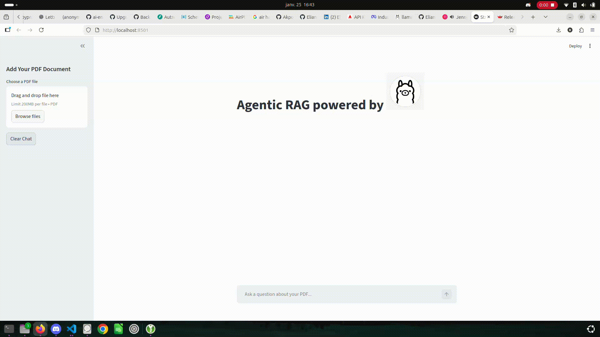

# RAG Application with FireCrawl Web Search Fallback
This repository contains a Retrieval-Augmented Generation (RAG) application that integrates a local Ollama model (`llama3.2:3b`) with FireCrawl for web search fallback. This setup allows the application to provide accurate and up-to-date information by leveraging both local knowledge and real-time web data.



The included [static/history_of_machine_learning.pdf](static/history_of_machine_learning.pdf) is a test PDF used for demo and validation.

## Installation and setup

**Get API Keys**:
   - [FireCrawl](https://www.firecrawl.dev/) - Optional for web search fallback.


**Recommended**: Create a virtual environment:
   ```bash
   python -m venv venv
   source venv/bin/activate  # On Windows use `venv\Scripts\activate`
   ```

   #### or use `conda`:
   ```bash
   conda create -n web_search_rag python=3.11 -y
   conda activate web_search_rag
   ```

**Install Dependencies**:
   Ensure you have Python 3.11 or later installed.
   ```bash
   pip install -e .
   ```

**Local Model Setup (Ollama)**:
   Install Ollama: https://ollama.com/download

   Pull the required model:
   ```bash
   ollama pull llama3.2:3b
   ```

**Running the app**:

Run the local Llama 3.2 app with FireCrawl web-search fallback:

```bash
streamlit run app.py
```

---
